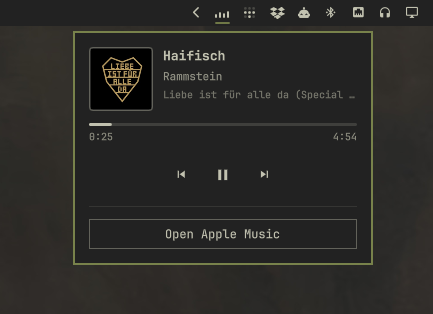

# Apple Music for Omarchy

Apple Music in the Omarchy bar, backed by a dedicated Chromium window and a
native, theme-aware now-playing panel.



## About this version

This project is a modification and continuation of Nick Pestov's excellent
[`nickpestov/omarchy-am`](https://github.com/nickpestov/omarchy-am). The
original project established the Chromium window lifecycle, MPRIS integration,
bar widget, and clean profile removal used here.

This version keeps that foundation and expands it with:

- A larger, keyboard-navigable native player panel.
- More robust track-change handling and progress reporting.
- A two-stage cover pipeline: Chromium's local MPRIS image appears quickly,
  then a higher-resolution match is queried from Apple's public iTunes Search
  and Lookup APIs.
- Album, artist, title, duration, and collection-aware matching with guarded
  fallbacks and small in-memory caches.
- Better coordination with Omarchy's bar popout navigation.

Thanks to Nick Pestov for the original implementation and its clear MIT
licensing. See [Credits](#credits) and [LICENSE](LICENSE).

## Features

- Left-click opens a native now-playing panel with artwork, metadata, progress,
  and previous/play-pause/next controls.
- The progress bar follows playback in real time and is interactive: click or
  drag anywhere on it to seek to a different position in the current track.
- Right-click opens or hides the real `music.apple.com` Chromium window. If it
  belongs to a Hyprland group, hiding detaches and moves only Apple Music while
  the other group members remain on their workspace. Opening it again joins
  the currently focused group, when there is one.
- Hiding Apple Music from a visible scratchpad detaches and parks only its
  window; the scratchpad and the rest of its group stay visible. Opening it
  again moves it into the current workspace and current group, when present.
- Apple Music is single-instance. Opening it from a focused group on a fresh
  launch remembers that group and adds only the new Apple Music window to it;
  an existing window in `special:Apple Music` is always brought to the current
  workspace instead of exposing that parking workspace. When the scratchpad is
  visible, it is the target workspace for the Apple Music window.
- Clicking the artwork or title always brings the player window into view.
- Scrolling the bar icon changes track.
- The music-note icon becomes a small equalizer during playback.
- The browser profile is separate from your normal Chromium profile.

## Requirements

- Omarchy 4 (Quattro) or newer
- `omarchy-shell` running on Hyprland
- `chromium`, `python3`, `curl`, and `jq` on `PATH`
- Chromium's Widevine CDM for protected playback

## Install

```sh
omarchy plugin add https://github.com/leandro-3rne/omarchy-apple-music.git --enable
```

The widget is placed on the right side of the bar by default. Move it with:

```sh
omarchy bar move io.github.leandro-3rne.apple-music --section right
```

On the first launch, Apple Music opens in a regular Chromium window so Apple's
sign-in flow can create its persistent session. Sign in and close that window;
later launches use the compact app window. Credentials and cookies remain inside
the plugin's dedicated local Chromium profile; they are never part of this
repository.

If an authenticated subscription still plays only 90-second previews, pin the
web player to the two-letter storefront of the Apple Account, close the Apple
Music window, and reopen it. For example:

```sh
~/.config/omarchy/plugins/io.github.leandro-3rne.apple-music/control.sh storefront ch
```

Replace `ch` with the account's country code. The selection is kept next to
the isolated browser profile and is not written to the plugin repository.

If Chromium was killed or crashed while Apple Music was open, the next launch
clears only stale singleton links from this dedicated profile. An active Apple
Music Chromium process and its socket are left untouched.

## Usage

- Left-click: open or close the now-playing panel.
- Right-click: open the Apple Music window, or hide it when it is visible.
- Scroll: previous or next track.
- Arrow keys: move through panel controls.
- With the progress bar selected, Left/Right seeks backward/forward 5 seconds;
  holding a key repeats in faster 10-second steps.
- On the progress bar, scroll down to seek forward 5 seconds or scroll up to
  seek backward 5 seconds.
- Enter/Space: activate the selected control.
- Click or drag the progress bar: seek within the current track when Apple
  Music reports that seeking is available.
- Escape: close the panel.

## IPC

```sh
omarchy-shell io.github.leandro-3rne.apple-music status
omarchy-shell io.github.leandro-3rne.apple-music open
omarchy-shell io.github.leandro-3rne.apple-music show
omarchy-shell io.github.leandro-3rne.apple-music playPause
omarchy-shell io.github.leandro-3rne.apple-music next
omarchy-shell io.github.leandro-3rne.apple-music previous
omarchy-shell io.github.leandro-3rne.apple-music refresh
```

## Privacy and network access

Playback metadata is read through Chromium's MPRIS interface. For improved
artwork and duration metadata, the plugin sends the current artist, title, and
album as search terms to Apple's public iTunes Search/Lookup endpoints. Cover
images are then fetched from Apple's artwork CDN. No Apple account credential,
cookie, browser profile, or local file is sent by the plugin.

The current MPRIS thumbnail is copied into a user-only runtime directory before
QML loads it. The copy is replaced on track changes and disappears with the
user session.

## Remove

```sh
omarchy plugin remove io.github.leandro-3rne.apple-music
```

Removal closes the dedicated Chromium window and deletes its isolated profile,
including its cache, cookies, and Apple Music sign-in. Disabling the plugin only
closes the window and preserves the profile for later use.

The profile is stored under:

```text
${XDG_DATA_HOME:-$HOME/.local/share}/leandro-3rne-apple-music
```

## Credits

- Original project: [Nick Pestov — omarchy-am](https://github.com/nickpestov/omarchy-am)
- Modification and extended artwork lookup: [leandro-3rne](https://github.com/leandro-3rne)
- Apple Music is a trademark of Apple Inc. This community project is not
  affiliated with or endorsed by Apple.

## License

MIT — see [LICENSE](LICENSE). The original copyright notice is retained.
